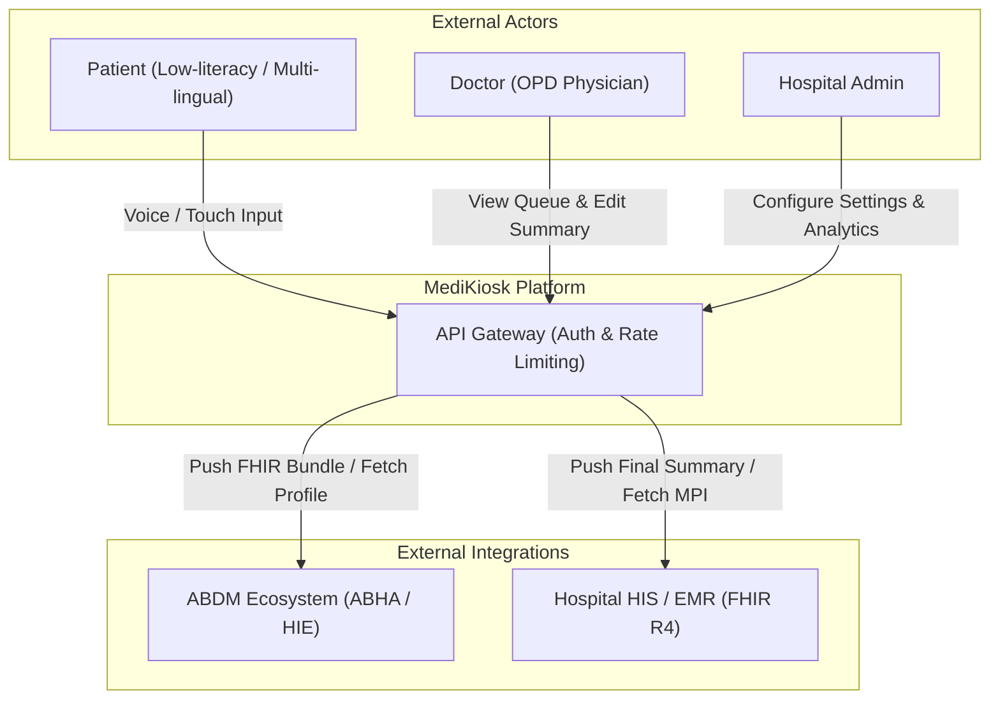
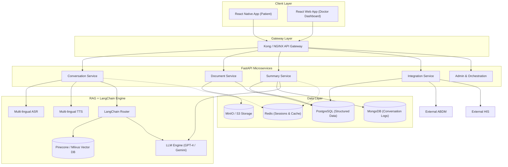
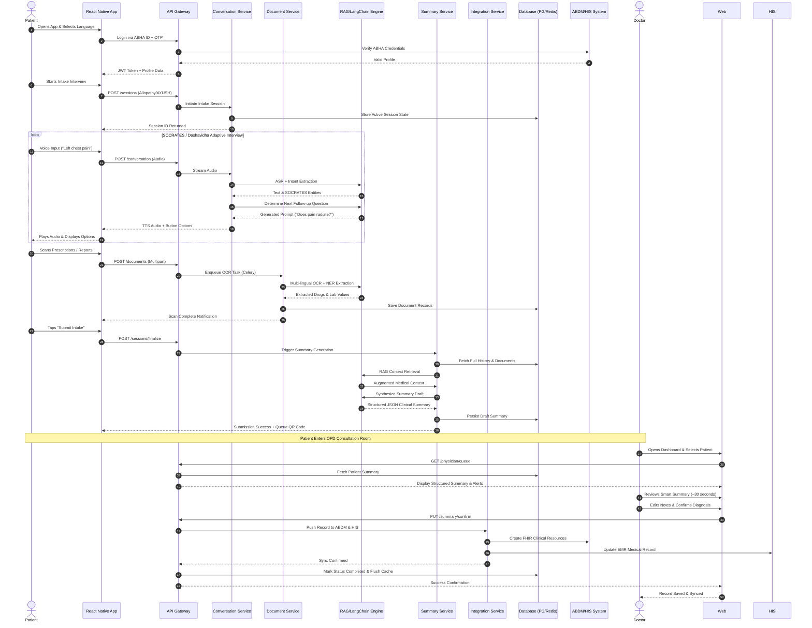
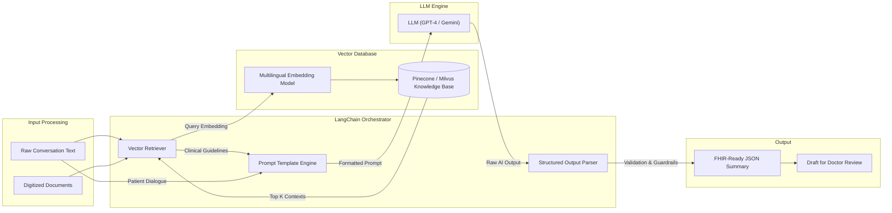

# System Architecture & Design Diagrams

## High-Level 4-Tier Architecture Overview

### 1. Client Layer
- **React Native Mobile App**: For Patients (Voice/Touch intake & Document scanning).
- **React Web App**: For Doctors (Queue & Smart Summary Dashboard) and Admins.

### 2. API Gateway Layer (Kong / Nginx)
- Handles routing, rate-limiting, JWT authentication, and OAuth 2.0 (Keycloak).

### 3. Core Microservices Layer (FastAPI)
- **`Conversation Service`**: Manages dialogue state, ASR/TTS integration, and dynamic questioning.
- **`Document Service`**: Handles image preprocessing, Tesseract/TrOCR, NER, and FHIR mapping.
- **`Summary Service`**: Triggers the RAG pipeline to generate the clinical draft.
- **`Integration Service`**: Dedicated bridge to ABDM/HIS with FHIR R4 APIs.
- **`Admin/Orchestration Service`**: Manages hospital queues, user roles, and system configurations.

### 4. Data & AI Layer
- **LLM & RAG**: LangChain orchestrates prompts. Vector DB (Pinecone/Milvus) stores clinical guidelines and AYUSH texts for retrieval augmentation.
- **Databases**:
  - **PostgreSQL**: Structured patient data.
  - **MongoDB**: Conversation history JSON.
  - **Redis**: Session caching.
  - **MinIO / AWS S3**: Document blobs.

---

## 1. High-Level System Context (C4 Level 1)

---

## 2. Core Microservices Architecture

---

## 3. End-to-End Full Data Flow (Sequence Diagram)

---

## 4. RAG + LangChain Internal AI Pipeline

---

## Detailed System Design Explanation (Full Flow Walkthrough)

### 1. The "Split-Second" Challenge
To solve the 2-minute consultation bottleneck, the system moves all cognitive data gathering to the waiting room. The architecture is event-driven and asynchronous.

### 2. Voice-First Design (Conversation Service)
- **Why FastAPI?** Supports native asynchronous WebSockets, which are crucial for streaming real-time voice transcription.
- **Dynamic Branching**: The system stores a clinical decision tree in Redis. If the patient says "chest pain," the `Conversation Service` queries the `RAG Router` to load the SOCRATES ontology. If the patient chooses "AYUSH," the router loads the Dashavidha Pariksha ontology instead.

### 3. The Document Intelligence (Document Service)
- Because handwritten Indian prescriptions are notoriously difficult to parse, a **2-step fallback** is used:
  - **Step 1**: Tesseract + custom trained TrOCR.
  - **Step 2**: If confidence < 80%, the image is queued to a human-in-the-loop (or a higher GPU model) without blocking the patient. The patient continues the voice interview while documents process in the background via Celery + RabbitMQ.

### 4. The "RAG" Magic (Summary Service)
- When the conversation ends, the system uses LangChain to **compress** the conversation (extracting only clinically relevant entities) and **augment** it with retrieved medical guidelines.
- **Guardrails**: A `PydanticValidator` in LangChain ensures that if the LLM tries to prescribe a specific drug dose, the validator strips it out and flags it as `"Unverified - Requires Physician Input"`, ensuring the AI never acts as a doctor.

### 5. The ABDM Integration Layer
- Specialized anti-corruption layer.
- Maps internal JSON schemas to **FHIR R4** resources (`Patient`, `Condition`, `Observation`, `Composition`).
- Handles ABDM Consent Manager flow: if a patient has not granted consent for sharing documents, the `Integration Service` redacts those entities before pushing to the HIE.

### 6. End-to-End Performance & Privacy
- **Total Pre-Consult Time**: ~8–10 minutes (waiting room intake).
- **Data Privacy**: All data is encrypted via TLS 1.3. Session data is destroyed immediately after doctor confirmation (`TTL = 0` in Redis) to comply with DPDP Act 2023 data minimization principles.
